# Multi-Tenant Authentication Guide for ClinicX

## Overview

This guide explains how frontend applications authenticate users in the multi-tenant ClinicX system where each tenant has their own Keycloak realm.

## Architecture

- **One Realm Per Tenant**: Each clinic gets its own Keycloak realm (e.g., `clinic-smile-dental`)
- **Tenant Identification**: Based on subdomain (e.g., `smile-dental.clinicx.com`)
- **User Attributes**: Each user has `tenant_id`, `clinic_name`, and `clinic_type` in their JWT tokens

### System Architecture Diagram


## Authentication Flow

### Authentication Flow Diagram

```mermaid
sequenceDiagram
    participant U as User
    participant F as Frontend<br/>(subdomain.clinicx.com)
    participant K as Keycloak<br/>(Tenant Realm)
    participant API as Backend API
    participant DB as Database
    
    Note over U,DB: Option A: Password Grant Flow
    U->>F: Enter credentials
    F->>F: Extract subdomain → realm
    F->>K: POST /realms/{realm}/token<br/>username, password
    K->>K: Validate credentials
    K->>K: Add tenant claims
    K->>F: JWT Token with tenant_id
    F->>F: Store token
    F->>API: API Request + Bearer Token
    API->>K: Validate token
    K->>API: Token valid
    API->>API: Extract tenant_id from JWT
    API->>DB: Query with tenant_id filter
    DB->>API: Tenant-filtered data
    API->>F: Response
    F->>U: Display data
    
    Note over U,DB: Option B: Authorization Code Flow
    U->>F: Click Login
    F->>K: Redirect to /auth?client_id=...
    K->>U: Show login page
    U->>K: Enter credentials
    K->>F: Redirect with ?code=...
    F->>K: POST /token with code
    K->>F: JWT Token with tenant_id
    F->>API: API Request + Bearer Token
    API->>F: Response
```



### 1. Tenant Creation Process

When a new tenant is created via the API:

```json
POST /api/v1/tenants
{
  "name": "Smile Dental Clinic",
  "subdomain": "smile-dental",
  "adminUsername": "admin",
  "adminEmail": "admin@smile-dental.com",
  "adminPassword": "SecurePassword123!",
  ...
}
```

The system automatically:
- Creates a new Keycloak realm: `clinic-smile-dental`
- Creates a backend client: `clinicx-backend` (with generated secret)
- Creates a frontend client: `clinicx-frontend` (public, no secret)
- Creates an admin user with tenant attributes
- Configures user profile with custom attributes
- Sets up protocol mappers for JWT claims

### Tenant Creation Flow Diagram


### 2. Frontend Authentication Options

#### Option A: Direct Password Grant (Simple but Less Secure)

```javascript
// Determine realm from subdomain
const subdomain = window.location.hostname.split('.')[0];
const realmName = `clinic-${subdomain}`;
const keycloakUrl = process.env.REACT_APP_KEYCLOAK_URL || 'http://localhost:18081';

async function login(username, password) {
  const tokenUrl = `${keycloakUrl}/realms/${realmName}/protocol/openid-connect/token`;
  
  try {
    const response = await fetch(tokenUrl, {
      method: 'POST',
      headers: {
        'Content-Type': 'application/x-www-form-urlencoded',
      },
      body: new URLSearchParams({
        'client_id': 'clinicx-frontend',
        'username': username,
        'password': password,
        'grant_type': 'password'
      })
    });
    
    if (!response.ok) {
      throw new Error('Authentication failed');
    }
    
    const tokenData = await response.json();
    
    // Store tokens
    localStorage.setItem('access_token', tokenData.access_token);
    localStorage.setItem('refresh_token', tokenData.refresh_token);
    
    return tokenData;
  } catch (error) {
    console.error('Login failed:', error);
    throw error;
  }
}
```

#### Option B: Authorization Code Flow (Recommended)

```javascript
class KeycloakAuth {
  constructor() {
    this.subdomain = window.location.hostname.split('.')[0];
    this.realmName = `clinic-${this.subdomain}`;
    this.keycloakUrl = process.env.REACT_APP_KEYCLOAK_URL || 'http://localhost:18081';
    this.clientId = 'clinicx-frontend';
    this.redirectUri = window.location.origin;
  }
  
  // Redirect to Keycloak login page
  login() {
    const authUrl = `${this.keycloakUrl}/realms/${this.realmName}/protocol/openid-connect/auth?` +
      `client_id=${this.clientId}&` +
      `redirect_uri=${encodeURIComponent(this.redirectUri)}&` +
      `response_type=code&` +
      `scope=openid profile email`;
    
    window.location.href = authUrl;
  }
  
  // Handle callback after login
  async handleCallback() {
    const urlParams = new URLSearchParams(window.location.search);
    const code = urlParams.get('code');
    
    if (!code) {
      throw new Error('No authorization code found');
    }
    
    const tokenUrl = `${this.keycloakUrl}/realms/${this.realmName}/protocol/openid-connect/token`;
    
    const response = await fetch(tokenUrl, {
      method: 'POST',
      headers: {
        'Content-Type': 'application/x-www-form-urlencoded',
      },
      body: new URLSearchParams({
        'client_id': this.clientId,
        'code': code,
        'redirect_uri': this.redirectUri,
        'grant_type': 'authorization_code'
      })
    });
    
    const tokenData = await response.json();
    
    // Store tokens
    localStorage.setItem('access_token', tokenData.access_token);
    localStorage.setItem('refresh_token', tokenData.refresh_token);
    
    // Clear code from URL
    window.history.replaceState({}, document.title, window.location.pathname);
    
    return tokenData;
  }
  
  // Refresh token
  async refreshToken() {
    const refreshToken = localStorage.getItem('refresh_token');
    if (!refreshToken) {
      throw new Error('No refresh token available');
    }
    
    const tokenUrl = `${this.keycloakUrl}/realms/${this.realmName}/protocol/openid-connect/token`;
    
    const response = await fetch(tokenUrl, {
      method: 'POST',
      headers: {
        'Content-Type': 'application/x-www-form-urlencoded',
      },
      body: new URLSearchParams({
        'client_id': this.clientId,
        'refresh_token': refreshToken,
        'grant_type': 'refresh_token'
      })
    });
    
    const tokenData = await response.json();
    
    // Update stored tokens
    localStorage.setItem('access_token', tokenData.access_token);
    localStorage.setItem('refresh_token', tokenData.refresh_token);
    
    return tokenData;
  }
  
  // Logout
  logout() {
    const logoutUrl = `${this.keycloakUrl}/realms/${this.realmName}/protocol/openid-connect/logout?` +
      `redirect_uri=${encodeURIComponent(this.redirectUri)}`;
    
    localStorage.removeItem('access_token');
    localStorage.removeItem('refresh_token');
    
    window.location.href = logoutUrl;
  }
}
```

### 3. Using Keycloak JS Adapter (Alternative)

```html
<!-- Include Keycloak JS -->
<script src="https://localhost:18081/js/keycloak.js"></script>
```

```javascript
// Initialize Keycloak
const keycloak = new Keycloak({
  url: 'http://localhost:18081',
  realm: `clinic-${subdomain}`,
  clientId: 'clinicx-frontend'
});

// Initialize and login
keycloak.init({ 
  onLoad: 'login-required',
  checkLoginIframe: false 
}).then(authenticated => {
  if (authenticated) {
    console.log('User is authenticated');
    // Store token
    localStorage.setItem('access_token', keycloak.token);
  }
}).catch(error => {
  console.error('Failed to initialize Keycloak', error);
});

// Auto-refresh token
setInterval(() => {
  keycloak.updateToken(30).then(refreshed => {
    if (refreshed) {
      localStorage.setItem('access_token', keycloak.token);
    }
  }).catch(() => {
    console.error('Failed to refresh token');
  });
}, 60000);
```

### 4. API Integration

```javascript
// Axios interceptor example
import axios from 'axios';

// Request interceptor to add token
axios.interceptors.request.use(
  config => {
    const token = localStorage.getItem('access_token');
    if (token) {
      config.headers.Authorization = `Bearer ${token}`;
    }
    return config;
  },
  error => Promise.reject(error)
);

// Response interceptor to handle 401
axios.interceptors.response.use(
  response => response,
  async error => {
    const originalRequest = error.config;
    
    if (error.response?.status === 401 && !originalRequest._retry) {
      originalRequest._retry = true;
      
      try {
        const auth = new KeycloakAuth();
        await auth.refreshToken();
        
        // Retry original request with new token
        originalRequest.headers.Authorization = `Bearer ${localStorage.getItem('access_token')}`;
        return axios(originalRequest);
      } catch (refreshError) {
        // Refresh failed, redirect to login
        auth.logout();
        return Promise.reject(refreshError);
      }
    }
    
    return Promise.reject(error);
  }
);
```

### 5. JWT Token Structure

After successful authentication, the JWT token contains:

```json
{
  "exp": 1704094423,
  "iat": 1704094123,
  "jti": "45f4b3c2-7e3a-4b91-b8f5-3c7e9a2d1234",
  "iss": "http://localhost:18081/realms/clinic-smile-dental",
  "sub": "f47ac10b-58cc-4372-a567-0e02b2c3d479",
  "typ": "Bearer",
  "azp": "clinicx-frontend",
  "session_state": "5d7f3e4b-8c3a-4b5f-a2e1-9c8b7d6f5e4a",
  "preferred_username": "admin@smile-dental.com",
  "email": "admin@smile-dental.com",
  "email_verified": true,
  "name": "John Doe",
  "given_name": "John",
  "family_name": "Doe",
  "tenant_id": "smile-dental-a1b2c3d4",
  "clinic_name": "Smile Dental Clinic",
  "clinic_type": "DENTAL",
  "realm_access": {
    "roles": ["ADMIN", "default-roles-clinic-smile-dental"]
  },
  "resource_access": {
    "clinicx-frontend": {
      "roles": ["uma_protection"]
    }
  },
  "scope": "openid profile email"
}
```

### Token Flow and Validation Diagram


### 6. Frontend Implementation Best Practices

#### Environment Configuration

```javascript
// config/auth.js
export const authConfig = {
  keycloakUrl: process.env.REACT_APP_KEYCLOAK_URL || 'http://localhost:18081',
  clientId: process.env.REACT_APP_CLIENT_ID || 'clinicx-frontend',
  realm: `clinic-${window.location.hostname.split('.')[0]}`,
  scope: 'openid profile email'
};
```

#### React Context Example

```javascript
// contexts/AuthContext.js
import React, { createContext, useState, useContext, useEffect } from 'react';
import { KeycloakAuth } from '../services/keycloak';

const AuthContext = createContext();

export const useAuth = () => {
  const context = useContext(AuthContext);
  if (!context) {
    throw new Error('useAuth must be used within AuthProvider');
  }
  return context;
};

export const AuthProvider = ({ children }) => {
  const [user, setUser] = useState(null);
  const [loading, setLoading] = useState(true);
  const [keycloak] = useState(new KeycloakAuth());
  
  useEffect(() => {
    // Check if returning from Keycloak redirect
    const urlParams = new URLSearchParams(window.location.search);
    if (urlParams.get('code')) {
      handleCallback();
    } else {
      checkAuthStatus();
    }
  }, []);
  
  const handleCallback = async () => {
    try {
      const tokenData = await keycloak.handleCallback();
      const userInfo = parseJwt(tokenData.access_token);
      setUser(userInfo);
    } catch (error) {
      console.error('Callback handling failed:', error);
    } finally {
      setLoading(false);
    }
  };
  
  const checkAuthStatus = () => {
    const token = localStorage.getItem('access_token');
    if (token) {
      try {
        const userInfo = parseJwt(token);
        // Check if token is expired
        if (userInfo.exp * 1000 > Date.now()) {
          setUser(userInfo);
        } else {
          // Try to refresh
          keycloak.refreshToken().then(tokenData => {
            const newUserInfo = parseJwt(tokenData.access_token);
            setUser(newUserInfo);
          }).catch(() => {
            localStorage.removeItem('access_token');
            localStorage.removeItem('refresh_token');
          });
        }
      } catch (error) {
        console.error('Invalid token:', error);
      }
    }
    setLoading(false);
  };
  
  const login = () => {
    keycloak.login();
  };
  
  const logout = () => {
    setUser(null);
    keycloak.logout();
  };
  
  const parseJwt = (token) => {
    const base64Url = token.split('.')[1];
    const base64 = base64Url.replace(/-/g, '+').replace(/_/g, '/');
    const jsonPayload = decodeURIComponent(atob(base64).split('').map(c => {
      return '%' + ('00' + c.charCodeAt(0).toString(16)).slice(-2);
    }).join(''));
    
    return JSON.parse(jsonPayload);
  };
  
  return (
    <AuthContext.Provider value={{
      user,
      loading,
      login,
      logout,
      tenantId: user?.tenant_id,
      clinicName: user?.clinic_name,
      clinicType: user?.clinic_type,
      roles: user?.realm_access?.roles || []
    }}>
      {children}
    </AuthContext.Provider>
  );
};
```

#### Protected Route Component

```javascript
// components/ProtectedRoute.js
import { Navigate } from 'react-router-dom';
import { useAuth } from '../contexts/AuthContext';

export const ProtectedRoute = ({ children, requiredRoles = [] }) => {
  const { user, loading, roles } = useAuth();
  
  if (loading) {
    return <div>Loading...</div>;
  }
  
  if (!user) {
    return <Navigate to="/login" />;
  }
  
  if (requiredRoles.length > 0) {
    const hasRequiredRole = requiredRoles.some(role => roles.includes(role));
    if (!hasRequiredRole) {
      return <Navigate to="/unauthorized" />;
    }
  }
  
  return children;
};
```

### 7. Testing Authentication

#### Manual Testing

```bash
# 1. Get token for a specific tenant
TENANT_SUBDOMAIN="smile-dental"
TOKEN=$(curl -s -X POST "http://localhost:18081/realms/clinic-${TENANT_SUBDOMAIN}/protocol/openid-connect/token" \
  -H "Content-Type: application/x-www-form-urlencoded" \
  -d "client_id=clinicx-frontend" \
  -d "username=admin@clinic.com" \
  -d "password=admin123" \
  -d "grant_type=password" | jq -r '.access_token')

# 2. Decode and view token claims
echo $TOKEN | cut -d. -f2 | base64 --decode | jq .

# 3. Test API with token
curl -H "Authorization: Bearer $TOKEN" http://localhost:8080/api/v1/patients
```

#### Integration Testing

```javascript
// __tests__/auth.test.js
describe('Multi-tenant Authentication', () => {
  beforeEach(() => {
    // Mock subdomain
    delete window.location;
    window.location = { hostname: 'smile-dental.clinicx.com' };
  });
  
  test('should extract correct realm from subdomain', () => {
    const auth = new KeycloakAuth();
    expect(auth.realmName).toBe('clinic-smile-dental');
  });
  
  test('should include tenant claims in token', async () => {
    // Mock successful login
    const mockToken = createMockJWT({
      tenant_id: 'smile-dental-123',
      clinic_name: 'Smile Dental',
      clinic_type: 'DENTAL'
    });
    
    // Test token parsing
    const claims = parseJwt(mockToken);
    expect(claims.tenant_id).toBe('smile-dental-123');
    expect(claims.clinic_name).toBe('Smile Dental');
    expect(claims.clinic_type).toBe('DENTAL');
  });
});
```

### 8. Troubleshooting

#### Common Issues

1. **CORS Errors**
   - Ensure Keycloak allows your frontend origin
   - Add frontend URL to Web Origins in client settings

2. **Invalid Realm Error**
   - Verify subdomain matches created tenant
   - Check realm name format: `clinic-{subdomain}`

3. **Missing Tenant Claims in Token**
   - Verify protocol mappers are configured
   - Check user has tenant attributes set
   - Ensure mappers are added to access token

4. **Token Expiration**
   - Implement automatic token refresh
   - Handle 401 responses properly
   - Set appropriate token lifespans

### Troubleshooting Flow Diagram


#### Debug Mode

Enable debug logging:

```javascript
// Enable Keycloak debug logs
if (process.env.NODE_ENV === 'development') {
  Keycloak.prototype.logInfo = console.info;
  Keycloak.prototype.logWarn = console.warn;
  Keycloak.prototype.logError = console.error;
}
```

### 9. Security Considerations

1. **Always use HTTPS in production**
2. **Store tokens securely** (consider using httpOnly cookies)
3. **Implement proper CSRF protection**
4. **Validate token signatures on backend**
5. **Use short token lifespans with refresh tokens**
6. **Implement rate limiting on token endpoints**
7. **Monitor for suspicious authentication patterns**

### 10. Migration Guide

For existing single-tenant applications:

1. **Update Frontend Routing**
   ```javascript
   // Old: Fixed realm
   const realm = 'clinicx-dev';
   
   // New: Dynamic realm from subdomain
   const realm = `clinic-${window.location.hostname.split('.')[0]}`;
   ```

2. **Update API Calls**
   - Ensure all API calls include the bearer token
   - Handle tenant-specific endpoints

3. **Update User Management**
   - Add tenant attributes to existing users
   - Ensure new users get proper tenant assignment

4. **Test Thoroughly**
   - Test with multiple tenants
   - Verify tenant isolation
   - Check role-based access control

### Migration Flow Diagram


## Summary

This multi-tenant authentication system provides:

- **Tenant Isolation**: Each clinic has its own Keycloak realm
- **Automatic Tenant Detection**: Based on subdomain
- **Secure Authentication**: Multiple flow options
- **Rich JWT Claims**: Include tenant information
- **Easy Frontend Integration**: Ready-to-use code examples

The diagrams above illustrate the complete flow from tenant creation to user authentication and API access, making it easy to understand and implement the system.