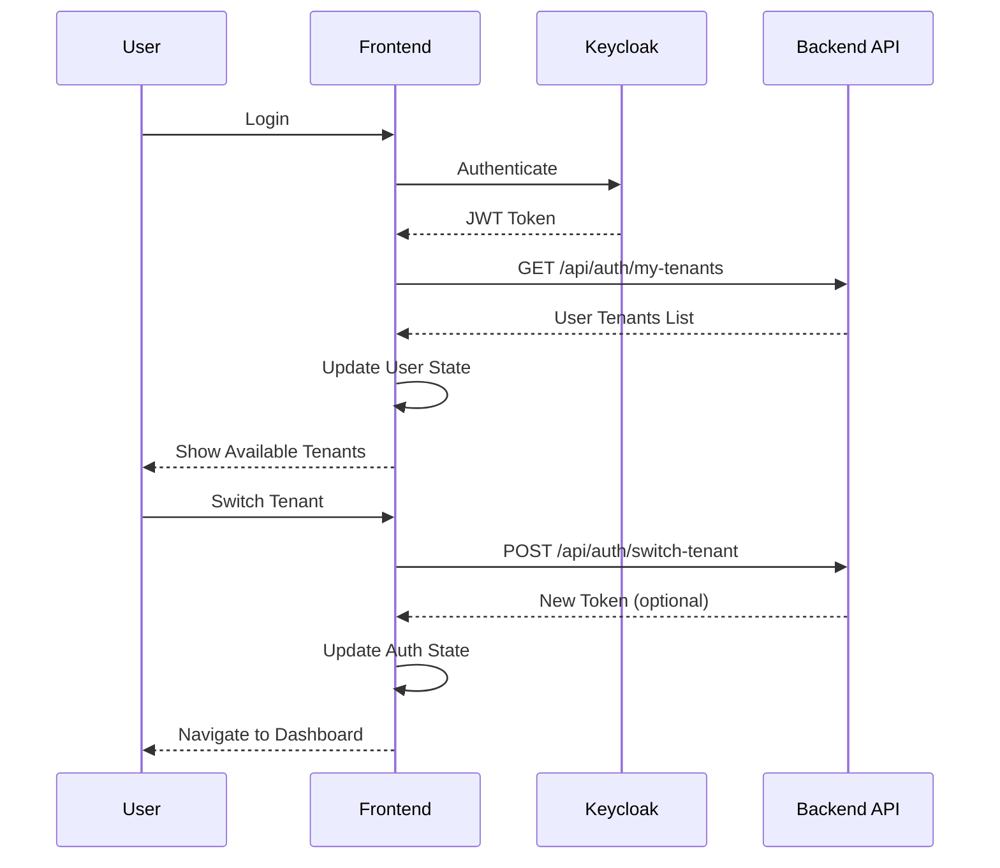

# Tenant API Integration

## Overview
This document describes the integration of the backend tenant API endpoints with the ClickX frontend application to support dynamic tenant fetching and switching.

## Implementation Details

### 1. API Endpoints

#### Get User Tenants
- **Endpoint**: `GET /api/auth/my-tenants`
- **Description**: Fetches all tenants accessible to the current user
- **Response Format**:
```json
[
  {
    "id": "dental-anas-4c40d19a",
    "name": "Dental Main anas",
    "specialty": "APPOINTMENTS",
    "roles": ["ADMIN"],
    "isActive": true,
    "subdomain": "appointments"
  }
]
```

#### Switch Tenant
- **Endpoint**: `POST /api/auth/switch-tenant`
- **Description**: Switches the user's active tenant
- **Request Body**:
```json
{
  "tenantId": "dental-anas-4c40d19a"
}
```
- **Response**: New JWT token with updated tenant context (optional)

### 2. Service Architecture

#### TenantApiService
Created `src/app/core/authentication/tenant-api.service.ts` to handle all tenant-related API calls:
- `getMyTenants()`: Fetches user's accessible tenants
- `switchTenant(tenantId)`: Switches to a different tenant
- `getTenantDetails(tenantId)`: Gets specific tenant details

#### Integration Points

1. **Login Flow**:
   - After successful Keycloak authentication, the app fetches user tenants
   - Updates user object with `accessible_tenants` array
   - Sets `active_tenant_id` to the first tenant if not already set

2. **App Initialization**:
   - When app loads with existing token, fetches tenants if not in JWT
   - Ensures user always has up-to-date tenant information

3. **Tenant Switching**:
   - Calls backend API to switch tenant
   - Updates token if new one is provided
   - Refreshes authentication state
   - Shows success/error notifications
   - Redirects to dashboard

### 3. Data Flow



### 4. Configuration

#### Environment Variables
Added `apiUrl` to environment files:
- Development: `http://localhost:8080/api`
- Production: `https://api.clickx.io/api`

#### HTTP Interceptor
The existing token interceptor automatically:
- Adds Authorization header with Bearer token
- Adds X-Tenant-ID header with active tenant ID

### 5. Error Handling

The implementation includes comprehensive error handling:
- API call failures don't crash the app
- Users see friendly error messages via snackbar
- Login continues even if tenant fetch fails
- Empty arrays returned on error to prevent UI issues

### 6. UI Updates

#### Tenant Switcher Component
- Displays fetched tenants from API
- Shows tenant name, specialty, and user role
- Loading state during switching
- Success/error notifications
- Disabled state for current tenant

### 7. Testing

To test the integration:

1. **Ensure backend is running** on `http://localhost:8080`
2. **Login** with valid credentials
3. **Check console** for "Fetched user tenants" log
4. **Open tenant switcher** - should show available tenants
5. **Switch tenant** - should show success message and redirect

### 8. Troubleshooting

Common issues and solutions:

1. **CORS Errors**:
   - Ensure backend allows frontend origin
   - Check proxy configuration in development

2. **401 Unauthorized**:
   - Verify token is being sent in Authorization header
   - Check token expiration

3. **Empty Tenant List**:
   - Verify user has tenants assigned in backend
   - Check API response in network tab

4. **Switching Fails**:
   - Ensure tenant ID is valid
   - Check backend logs for errors

### 9. Future Enhancements

Potential improvements:
- Cache tenant list to reduce API calls
- Add tenant search/filter for users with many tenants
- Support for tenant invitations
- Tenant-specific theme customization
- Remember last selected tenant